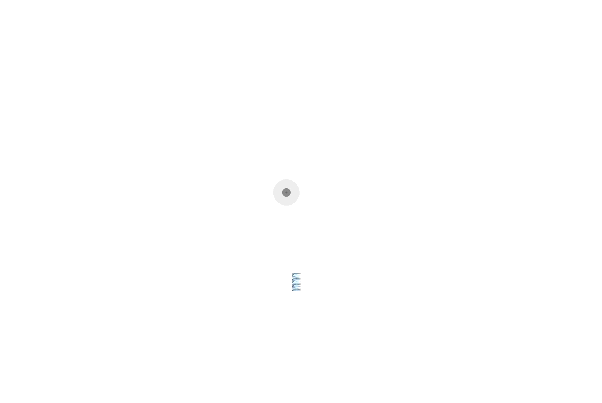

# RIPE SDK Components for Vue.js

Vue.js components for [RIPE SDK](https://github.com/ripe-tech/ripe-sdk).

## Configurator 

The configurator component provides an interactive configuration experience inside a DOM. The user can interact with a model by rotating, highlighting and selecting it.

To instantiate the component it is necessary to provide:
| Prop        | Type    | Required | Description |
| ----------- | ------- | -------- | ----------- |
| brand      | `String` | `true` | The brand of the model. | 
| model   | `String` | `true` | The name of the model. |
| version   | `Number` | `true`  | The version of the build. |
| parts   | `Object` | `false`  | The parts of the customized build. |
| frame   | `String` | `false`  | The name of the frame to be shown in the configurator. |
| size   | `Number` | `false`  | The size (in pixels) of the configurator. If not defined, the configurator will use all the screen space available. |
| ripeSdk   | `Number` | `false`  | Instance of Ripe SDK initialized, if not defined, the global Ripe SDK instance will be used. |

An example of an instantiation and the correspondent view:

```
<ripe-configurator 
    v-bind:brand="'dummy'"
    v-bind:model="'cube'"
    v-bind:version="52"
    v-bind:size="1000"
/>
```


The frame can be controlled externally to the component, by changing the prop `frame`:

```
<ripe-configurator 
    v-bind:brand="'dummy'"
    v-bind:model="'cube'"
    v-bind:version="52"
    v-bind:size="1000"
    v-bind:frame="'top-0'"
/>
```


