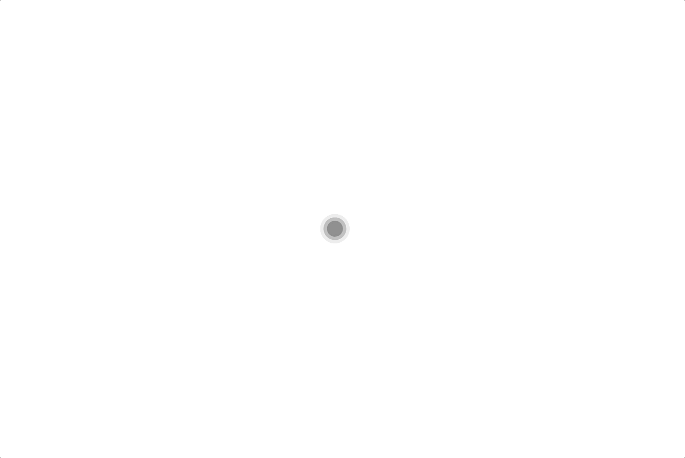
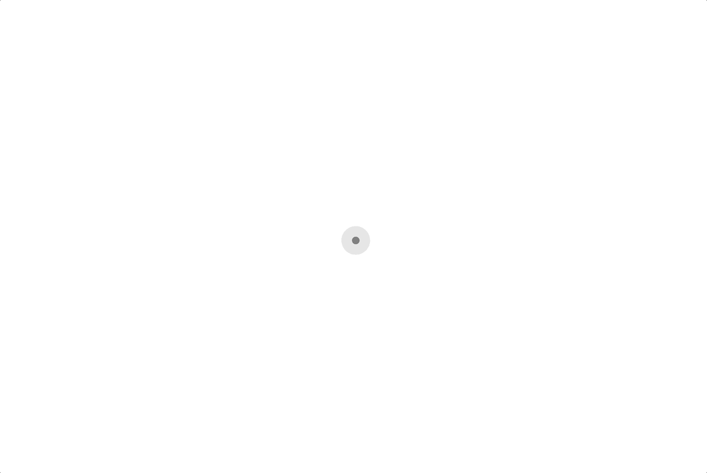
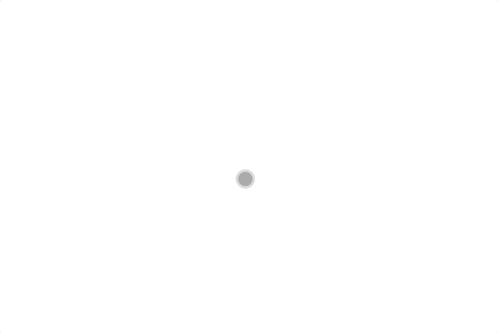
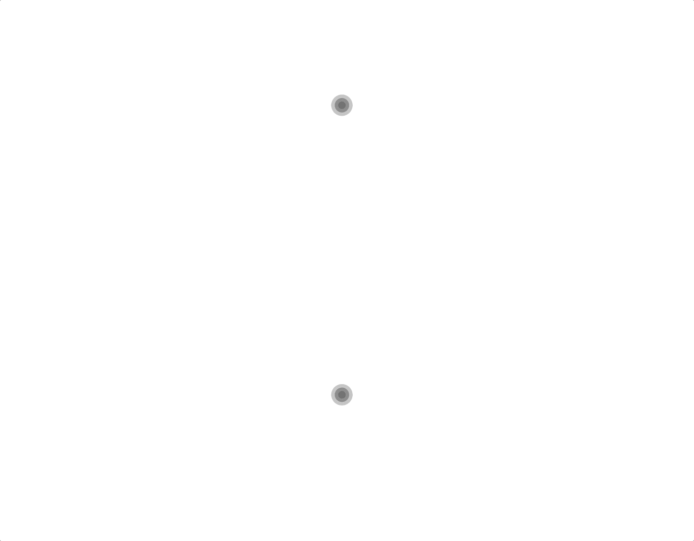
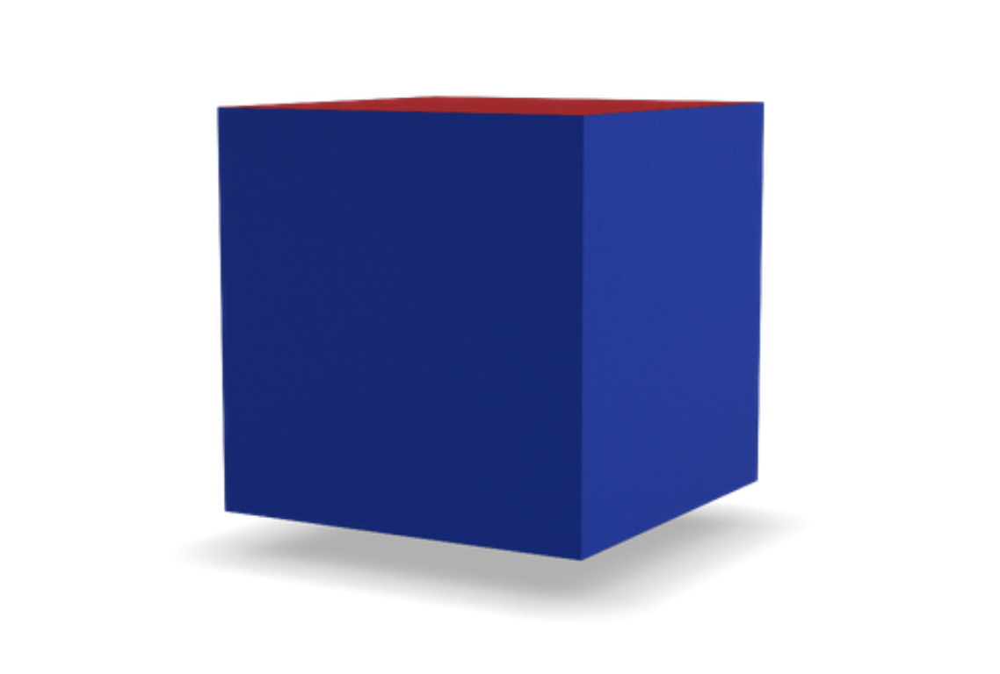
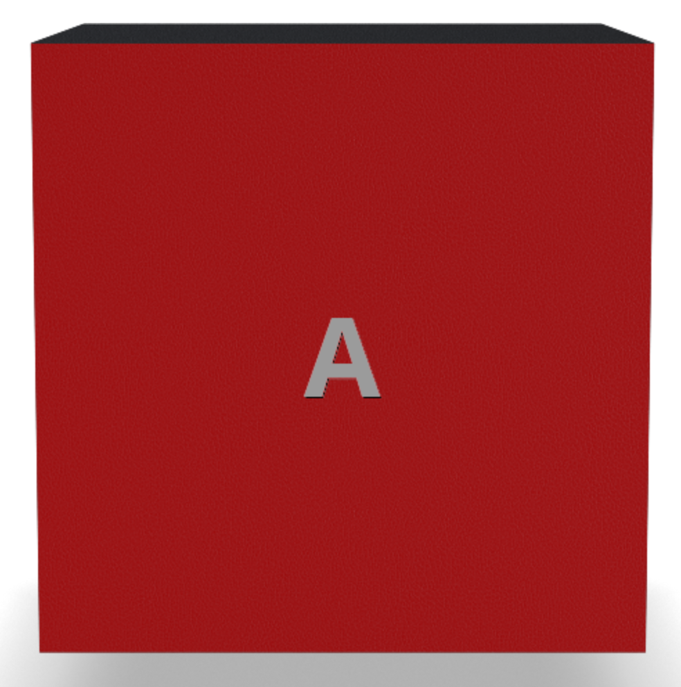
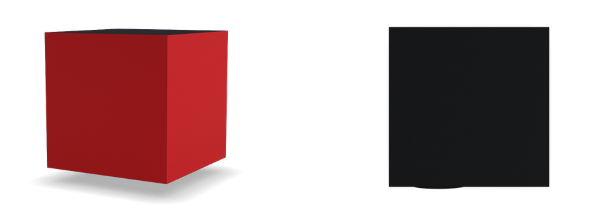

# RIPE SDK Components for Vue.js

Vue.js components for [RIPE SDK](https://github.com/ripe-tech/ripe-sdk).

## Configurator

The configurator component provides an interactive configuration experience inside a DOM. The user can interact with a model by rotating, highlighting and selecting it.

The configurator can receive the following parameters:

| Prop    | Type     | Required | Description                                                                                                                                    |
| ------- | -------- | -------- | ---------------------------------------------------------------------------------------------------------------------------------------------- |
| brand   | `String` | `true`   | The brand of the model.                                                                                                                        |
| model   | `String` | `true`   | The name of the model.                                                                                                                         |
| version | `Number` | `true`   | The version of the build.                                                                                                                      |
| parts   | `Object` | `false`  | The model's customization.                                                                                                                     |
| frame   | `String` | `false`  | The name of the frame to be shown in the configurator. For example, frame `1` on `side` would be `side-1`, and a `top` frame would be `top-1`. |
| size    | `Number` | `false`  | The size (in pixels) of the configurator. If not defined, the configurator will use all the screen space available.                            |
| ripe    | `Number` | `false`  | Instance of Ripe SDK initialized, if not defined, the global Ripe SDK instance will be used.                                                   |

An example of an instantiation and the correspondent view:

```html
<ripe-configurator
    v-bind:brand="'dummy'"
    v-bind:model="'cube'"
    v-bind:version="52"
    v-bind:size="1000"
/>
```



The frame can be controlled externally to the component, by changing the prop `frame`:

```html
<ripe-configurator
    v-bind:brand="'dummy'"
    v-bind:model="'cube'"
    v-bind:version="52"
    v-bind:size="1000"
    v-bind:frame="'top-0'"
/>
```



The customization of the model can also be provided, with the prop `parts`:

```html
<ripe-configurator
    v-bind:brand="'dummy'"
    v-bind:model="'cube'"
    v-bind:version="52"
    v-bind:size="1000"
    v-bind:frame="'side-4'"
    v-bind:parts="{
        side: {
            color: 'blue',
            material: 'leather_cbe',
            face: 'side'
        },
        shadow: {
            color: 'default',
            hidden: true,
            material: 'default'
        },
        top0_bottom: {
            color: 'red',
            face: 'side',
            material: 'leather_cbe'
        }
    }"
/>
```



There can be more than one configurator using the same instance of Ripe SDK:

```html
<ripe-configurator
    v-bind:brand="'dummy'"
    v-bind:model="'cube'"
    v-bind:version="52"
    v-bind:size="500"
    v-bind:ripe="ripe"
/>
<ripe-configurator
    v-bind:brand="'dummy'"
    v-bind:model="'cube'"
    v-bind:version="52"
    v-bind:size="500"
    v-bind:frame="'side-10'"
    v-bind:ripe="ripe"
/>
```

Which uses a Ripe SDK instance that can be initialized like this:

```javascript
this.ripe = new Ripe();
await this.ripe.config("dummy", "cube", {
    version: 52
});
```



## Image

The image component `<ripe-image>` allows for the visualization of a given model.

The image can receive the following parameters:

| Prop            | Type       | Required | Description                                                                                                                                                                                                |
| --------------- | ---------- | -------- | ---------------------------------------------------------------------------------------------------------------------------------------------------------------------------------------------------------- |
| brand           | `String`   | `true`   | The brand of the model.                                                                                                                                                                                    |
| model           | `String`   | `true`   | The name of the model.                                                                                                                                                                                     |
| version         | `Number`   | `true`   | The version of the build.                                                                                                                                                                                  |
| parts           | `Object`   | `false`  | The model's customization.                                                                                                                                                                                 |
| frame           | `String`   | `false`  | The name of the frame to be shown in the image. For example, frame `1` on `side` would be `side-1`, and a `top` frame would be `top-1`.                                                                    |
| size            | `Number`   | `false`  | The size (in pixels) of the image. If not defined, the image will use all the screen space available.                                                                                                      |
| format          | `String`   | `false`  | The format of the image, (eg: png, jpg, svg, etc.). Defaults to 'png'.                                                                                                                                     |
| crop            | `Boolean`  | `false`  | Indicates that the image composition is to be cropped. Crops the current image according to the minimal possible bounding box in both x and y axis.                                                        |
| showInitials    | `Boolean`  | `false`  | Indicates if the personalization should be shown. Defaults to `false`.                                                                                                                                     |
| initialsGroup   | `String`   | `false`  | The group in which the image initials belongs to.                                                                                                                                                          |
| initialsBuilder | `Function` | `false`  | A function that receives the initials and engraving as strings and the img element that will be used and returns a map with the initials and a profile list.                                               |
| state           | `Object`   | `false`  | An object containing the state of the personalization. For each group of the model it can contain the initials and the corresponding engraving (eg. { main: { initials: "AB", engraving: "style:grey" }}). |
| ripe            | `Number`   | `false`  | Instance of Ripe SDK initialized, if not defined, the global Ripe SDK instance will be used.                                                                                                               |
| name            | `String`   | `false`  | Name of the image.                                                                                                                                                                                         |

An example of an instantiation and the correspondent view:

```html
<ripe-image v-bind:brand="'dummy'" v-bind:model="'cube'" v-bind:version="52" v-bind:size="500" />
```


Similar to the configurator, the frame can be controlled externally to the component, by changing the prop `frame`:

```html
<ripe-image
    v-bind:brand="'dummy'"
    v-bind:model="'cube'"
    v-bind:version="52"
    v-bind:size="1000"
    v-bind:frame="'top-0'"
/>
```


The customization of the model can also be provided, with the prop parts:

```html
<ripe-image
    v-bind:brand="'dummy'"
    v-bind:model="'cube'"
    v-bind:version="52"
    v-bind:size="500"
    v-bind:frame="'side-4'"
    v-bind:parts="{
        side: {
            color: 'blue',
            material: 'leather_cbe',
            face: 'side'
        },
        shadow: {
            color: 'default',
            hidden: true,
            material: 'default'
        },
        top0_bottom: {
            color: 'red',
            face: 'side',
            material: 'leather_cbe'
        }
    }"
/>
```



The Image component support more complex logic and attributes, such as different formats, crops and personalization options.
By setting the `show-initials` to `true` and providing an `initials-group` and `state`, it is possible to show initials in the model.

A `state` example:

```javascript
const state = {
    initialsExtra: {
        main: {
            initials: "A",
            engraving: "style:white"
        }
    }
};
```

```html
<ripe-image
    v-bind:brand="'dummy'"
    v-bind:model="'cube'"
    v-bind:version="52"
    v-bind:size="1000"
    v-bind:frame="'side-0'"
    v-bind:format="'png'"
    v-bind:crop="true"
    v-bind:show-initials="true"
    v-bind:initials-group="'main'"
    v-bind:state="state"
/>
```



It is also possible to provide a `initialsBuilder` function, that allows for a more custom logic in the translation from initials and engraving into initials and profiles.

There can be more than one image using the same instance of Ripe SDK:

```html
<ripe-image
    v-bind:brand="'dummy'"
    v-bind:model="'cube'"
    v-bind:version="52"
    v-bind:size="500"
    v-bind:frame="'side-4'"
    v-bind:ripe="ripe"
/>
<ripe-image
    v-bind:brand="'dummy'"
    v-bind:model="'cube'"
    v-bind:version="52"
    v-bind:size="500"
    v-bind:frame="'top-0'"
    v-bind:ripe="ripe"
/>
```


