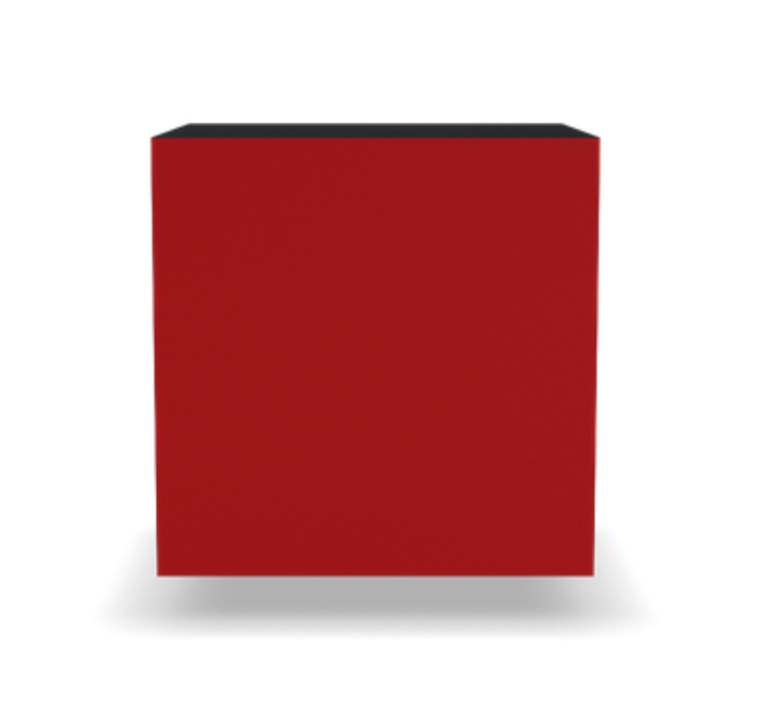
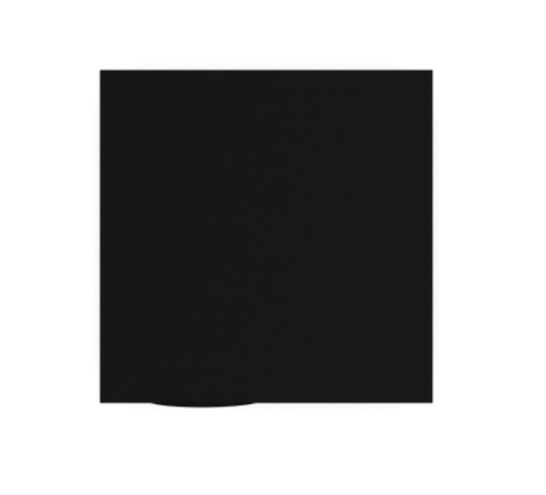
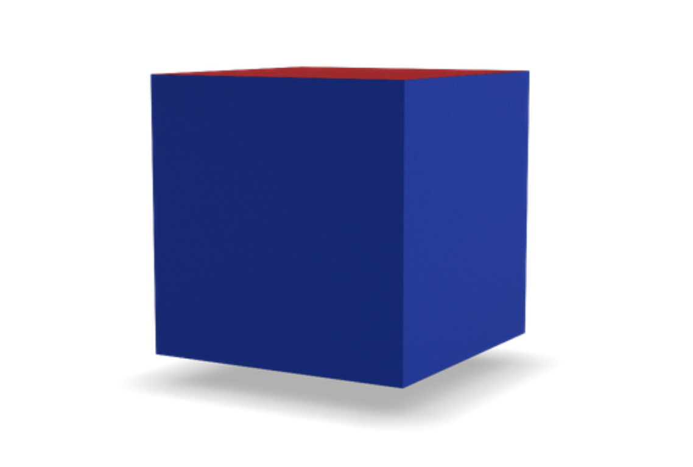
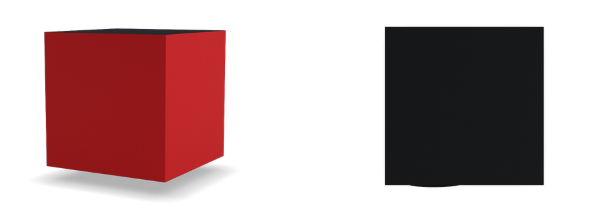

# RIPE SDK Components for Vue.js

Vue.js components for [RIPE SDK](https://github.com/ripe-tech/ripe-sdk).

## Image

The image component `<ripe-image>` allows for the visualization of a given model. 

The image can receive the following parameters:

| Prop        | Type    | Required | Description |
| ----------- | ------- | -------- | ----------- |
| brand      | `String` | `true` | The brand of the model. | 
| model   | `String` | `true` | The name of the model. |
| version   | `Number` | `true`  | The version of the build. |
| parts   | `Object` | `false`  | The model's customization. |
| frame   | `String` | `false`  | The name of the frame to be shown in the image. For example, frame `1` on `side` would be `side-1`, and a `top` frame would be `top-1`.  |
| size   | `Number` | `false`  | The size (in pixels) of the image. If not defined, the image will use all the screen space available. |
| ripeSdk   | `Number` | `false`  | Instance of Ripe SDK initialized, if not defined, the global Ripe SDK instance will be used. |

An example of an instantiation and the correspondent view:

```
<ripe-image 
    v-bind:brand="'dummy'"
    v-bind:model="'cube'"
    v-bind:version="52"
    v-bind:size="500"
/>
```



Similar to the configurator, the frame can be controlled externally to the component, by changing the prop `frame`:

```
<ripe-image
    v-bind:brand="'dummy'"
    v-bind:model="'cube'"
    v-bind:version="52"
    v-bind:size="1000"
    v-bind:frame="'top-0'"
/>
```



The customization of the model can also be provided, with the prop parts:

```
<ripe-image
    v-bind:brand="'dummy'"
    v-bind:model="'cube'"
    v-bind:version="52"
    v-bind:size="500"
    v-bind:frame="'side-4'"
    v-bind:parts="{
        side: {
            color: 'blue',
            material: 'leather_cbe',
            face: 'side'
        },
        shadow: {
            color: 'default',
            hidden: true,
            material: 'default'
        },
        top0_bottom: {
            color: 'red',
            face: 'side',
            material: 'leather_cbe'
        }
    }"
/>
```



There can be more than one image using the same instance of Ripe SDK:

```
<ripe-image
    v-bind:brand="'dummy'"
    v-bind:model="'cube'"
    v-bind:version="52"
    v-bind:size="500"
    v-bind:frame="'side-4'"
    v-bind:ripe-sdk="ripeSdk"
/>
<ripe-image
    v-bind:brand="'dummy'"
    v-bind:model="'cube'"
    v-bind:version="52"
    v-bind:size="500"
    v-bind:frame="'top-0'"
    v-bind:ripe-sdk="ripeSdk"
/>
```

