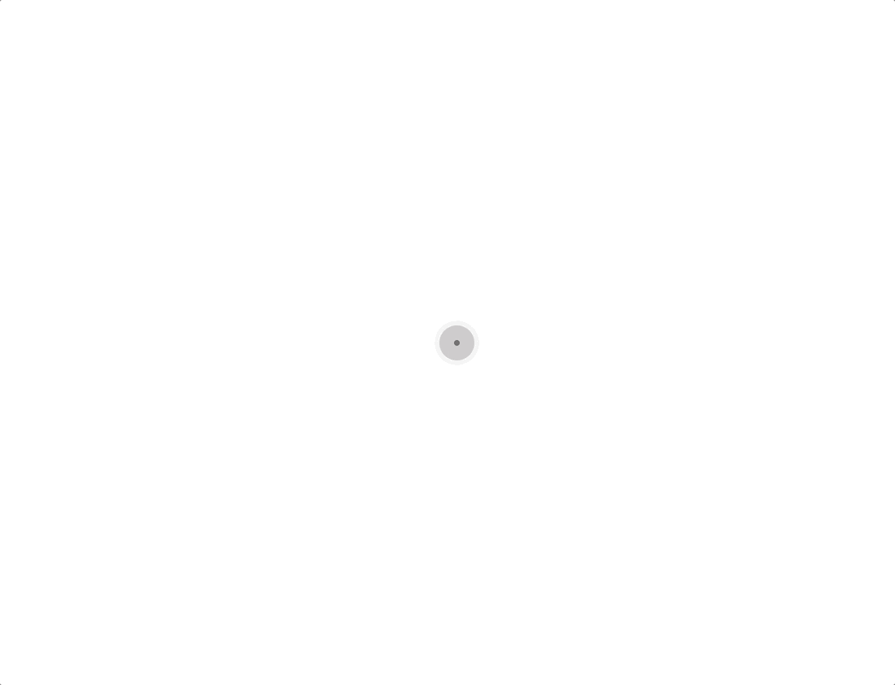

# RIPE SDK Components for Vue.js

Vue.js components for [RIPE SDK](https://github.com/ripe-tech/ripe-sdk).

## Configurator

The configurator component provides an interactive configuration experience inside a DOM. The user can interact with a model by rotating, highlighting and selecting it.

The configurator can receive the following parameters:

| Prop            | Type      | Required | Description                                                                                                                                    |
| --------------- | --------- | -------- | ---------------------------------------------------------------------------------------------------------------------------------------------- |
| brand           | `String`  | `true`   | The brand of the model.                                                                                                                        |
| model           | `String`  | `true`   | The name of the model.                                                                                                                         |
| version         | `Number`  | `true`   | The version of the build.                                                                                                                      |
| parts           | `Object`  | `false`  | The model's customization.                                                                                                                     |
| frame           | `String`  | `false`  | The name of the frame to be shown in the configurator. For example, frame `1` on `side` would be `side-1`, and a `top` frame would be `top-1`. |
| size            | `Number`  | `false`  | The size (in pixels) of the configurator. If not defined, the configurator will use all the screen space available.                            |
| loader          | `Boolean` | `false`  | Flag for showing a loader when the configurator is loading.                                                                                    |
| selectedPart    | `String`  | `false`  | Part of the model that is currently selected (eg: side).                                                                                       |
| highlightedPart | `String`  | `false`  | Part of the model that is currently highlighted (eg:side). Only possible if the usage of masks is enabled.                                     |
| sensitivity     | `Number`  | `false`  | Configurator rotation sensitivity to the user mouse drag action. The bigger the number, more sensible it is.                                   |
| useMasks        | `Boolean` | `false`  | Usage of masks in the current model, necessary for the part highlighting action.                                                               |
| duration        | `Number`  | `false`  | The duration in milliseconds that the configurator frame transition should take.                                                               |
| animation       | `String`  | `false`  | The configurator animation style: 'simple' (fade in), 'cross' (crossfade) or 'null'.                                                           |
| format          | `String`  | `false`  | The format of the configurator image, (eg: png, jpg, svg, etc.).                                                                               |
| ripe            | `Number`  | `false`  | Instance of Ripe SDK initialized, if not defined, the global Ripe SDK instance will be used.                                                   |

An example of an instantiation and the correspondent view:

```html
<ripe-configurator
    v-bind:brand="'dummy'"
    v-bind:model="'cube'"
    v-bind:version="52"
    v-bind:size="1000"
    v-bind:loader="true"
/>
```


The frame can be controlled externally to the component, by changing the prop `frame`:

```html
<ripe-configurator
    v-bind:brand="'dummy'"
    v-bind:model="'cube'"
    v-bind:version="52"
    v-bind:size="1000"
    v-bind:frame="'top-0'"
/>
```


The customization of the model can also be provided, with the prop `parts`:

```html
<ripe-configurator
    v-bind:brand="'dummy'"
    v-bind:model="'cube'"
    v-bind:version="52"
    v-bind:size="1000"
    v-bind:frame="'side-4'"
    v-bind:parts="{
        side: {
            color: 'blue',
            material: 'leather_cbe',
            face: 'side'
        },
        shadow: {
            color: 'default',
            hidden: true,
            material: 'default'
        },
        top0_bottom: {
            color: 'red',
            face: 'side',
            material: 'leather_cbe'
        }
    }"
/>
```


The sensitivity, duration and other configurator attributes when first building the component. This attributes in addition to brand, model and version can later be changed, causing the configurator to load again.
It is also possible to define the highlighted part of the configurator, which will use masks to identify it. However, this highlighted part will only show after the first build of the configurator.

```html
<ripe-configurator
    v-bind:brand="'dummy'"
    v-bind:model="'cube'"
    v-bind:version="52"
    v-bind:size="1000"
    v-bind:frame="'side-4'"
    v-bind:loader="true"
    v-bind:selected-part="'side'"
    v-bind:highlighted-part="'side'"
    v-bind:sensitivity="100"
    v-bind:use-masks="true"
    v-bind:duration="1000"
    v-bind:animation="'cross'"
    v-bind:format="'png'"
/>
```



There can be more than one configurator using the same instance of Ripe SDK:

```html
<ripe-configurator
    v-bind:brand="'dummy'"
    v-bind:model="'cube'"
    v-bind:version="52"
    v-bind:size="500"
    v-bind:ripe="ripe"
/>
<ripe-configurator
    v-bind:brand="'dummy'"
    v-bind:model="'cube'"
    v-bind:version="52"
    v-bind:size="500"
    v-bind:frame="'side-10'"
    v-bind:ripe="ripe"
/>
```

Which uses a Ripe SDK instance that can be initialized like this:

```javascript
this.ripe = new Ripe();
await this.ripe.config("dummy", "cube", {
    version: 52
});
```


## Image

The image component `<ripe-image>` allows for the visualization of a given model.

The image can receive the following parameters:

| Prop    | Type     | Required | Description                                                                                                                             |
| ------- | -------- | -------- | --------------------------------------------------------------------------------------------------------------------------------------- |
| brand   | `String` | `true`   | The brand of the model.                                                                                                                 |
| model   | `String` | `true`   | The name of the model.                                                                                                                  |
| version | `Number` | `true`   | The version of the build.                                                                                                               |
| parts   | `Object` | `false`  | The model's customization.                                                                                                              |
| frame   | `String` | `false`  | The name of the frame to be shown in the image. For example, frame `1` on `side` would be `side-1`, and a `top` frame would be `top-1`. |
| size    | `Number` | `false`  | The size (in pixels) of the image. If not defined, the image will use all the screen space available.                                   |
| ripe    | `Number` | `false`  | Instance of Ripe SDK initialized, if not defined, the global Ripe SDK instance will be used.                                            |

An example of an instantiation and the correspondent view:

```
<ripe-image
    v-bind:brand="'dummy'"
    v-bind:model="'cube'"
    v-bind:version="52"
    v-bind:size="500"
/>
```


Similar to the configurator, the frame can be controlled externally to the component, by changing the prop `frame`:

```
<ripe-image
    v-bind:brand="'dummy'"
    v-bind:model="'cube'"
    v-bind:version="52"
    v-bind:size="1000"
    v-bind:frame="'top-0'"
/>
```


The customization of the model can also be provided, with the prop parts:

```
<ripe-image
    v-bind:brand="'dummy'"
    v-bind:model="'cube'"
    v-bind:version="52"
    v-bind:size="500"
    v-bind:frame="'side-4'"
    v-bind:parts="{
        side: {
            color: 'blue',
            material: 'leather_cbe',
            face: 'side'
        },
        shadow: {
            color: 'default',
            hidden: true,
            material: 'default'
        },
        top0_bottom: {
            color: 'red',
            face: 'side',
            material: 'leather_cbe'
        }
    }"
/>
```


There can be more than one image using the same instance of Ripe SDK:

```
<ripe-image
    v-bind:brand="'dummy'"
    v-bind:model="'cube'"
    v-bind:version="52"
    v-bind:size="500"
    v-bind:frame="'side-4'"
    v-bind:ripe="ripe"
/>
<ripe-image
    v-bind:brand="'dummy'"
    v-bind:model="'cube'"
    v-bind:version="52"
    v-bind:size="500"
    v-bind:frame="'top-0'"
    v-bind:ripe="ripe"
/>
```


