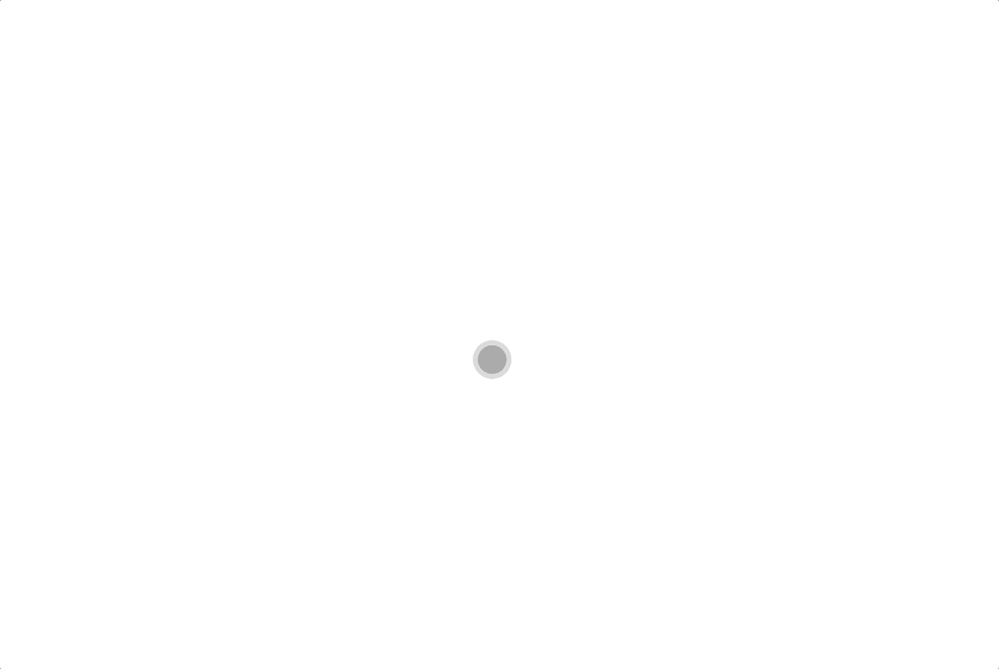
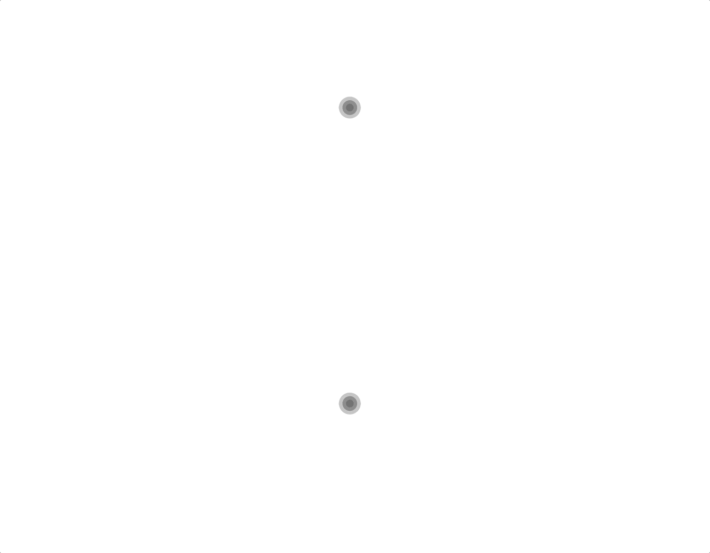

# RIPE SDK Components for Vue.js

Vue.js components for [RIPE SDK](https://github.com/ripe-tech/ripe-sdk).

## Configurator

The configurator component provides an interactive configuration experience inside a DOM. The user can interact with a model by rotating, highlighting and selecting it.

The configurator can receive the following parameters:
| Prop    | Type     | Required | Description                                                                                                                                    |
| ------- | -------- | -------- | ---------------------------------------------------------------------------------------------------------------------------------------------- |
| brand   | `String` | `true`   | The brand of the model.                                                                                                                        |
| model   | `String` | `true`   | The name of the model.                                                                                                                         |
| version | `Number` | `true`   | The version of the build.                                                                                                                      |
| parts   | `Object` | `false`  | The model's customization.                                                                                                                     |
| frame   | `String` | `false`  | The name of the frame to be shown in the configurator. For example, frame `1` on `side` would be `side-1`, and a `top` frame would be `top-1`. |
| size    | `Number` | `false`  | The size (in pixels) of the configurator. If not defined, the configurator will use all the screen space available.                            |
| ripeSdk | `Number` | `false`  | Instance of Ripe SDK initialized, if not defined, the global Ripe SDK instance will be used.                                                   |

An example of an instantiation and the correspondent view:

```html
<ripe-configurator
    v-bind:brand="'dummy'"
    v-bind:model="'cube'"
    v-bind:version="52"
    v-bind:size="1000"
/>
```


The frame can be controlled externally to the component, by changing the prop `frame`:

```html
<ripe-configurator
    v-bind:brand="'dummy'"
    v-bind:model="'cube'"
    v-bind:version="52"
    v-bind:size="1000"
    v-bind:frame="'top-0'"
/>
```


The customization of the model can also be provided, with the prop `parts`:

```html
<ripe-configurator
    v-bind:brand="'dummy'"
    v-bind:model="'cube'"
    v-bind:version="52"
    v-bind:size="1000"
    v-bind:frame="'side-4'"
    v-bind:parts="{
        side: {
            color: 'blue',
            material: 'leather_cbe',
            face: 'side'
        },
        shadow: {
            color: 'default',
            hidden: true,
            material: 'default'
        },
        top0_bottom: {
            color: 'red',
            face: 'side',
            material: 'leather_cbe'
        }
    }"
/>
```



There can be more than one configurator using the same instance of Ripe SDK:

```html
<ripe-configurator
    v-bind:brand="'dummy'"
    v-bind:model="'cube'"
    v-bind:version="52"
    v-bind:size="500"
    v-bind:ripe-sdk="ripeSdk"
/>
<ripe-configurator
    v-bind:brand="'dummy'"
    v-bind:model="'cube'"
    v-bind:version="52"
    v-bind:size="500"
    v-bind:frame="'side-10'"
    v-bind:ripe-sdk="ripeSdk"
/>
```

Which uses a Ripe SDK instance that can be initialized like this:

```html
this.ripeSdk = new Ripe();
await this.ripeSdk.config("dummy", "cube", {
    version: 52
});
```


