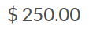
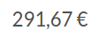
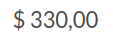
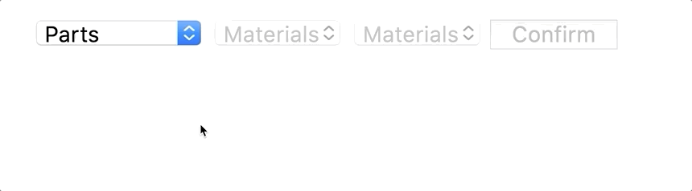

# RIPE SDK Components for Vue.js

Vue.js components for [RIPE SDK](https://github.com/ripe-tech/ripe-sdk).

## Configurator

The configurator component provides an interactive configuration experience inside a DOM. The user can interact with a model by rotating, highlighting and selecting it.

The configurator can receive the following parameters:

| Prop    | Type     | Required | Description                                                                                                                                    |
| ------- | -------- | -------- | ---------------------------------------------------------------------------------------------------------------------------------------------- |
| brand   | `String` | `true`   | The brand of the model.                                                                                                                        |
| model   | `String` | `true`   | The name of the model.                                                                                                                         |
| version | `Number` | `true`   | The version of the build.                                                                                                                      |
| parts   | `Object` | `false`  | The model's customization.                                                                                                                     |
| frame   | `String` | `false`  | The name of the frame to be shown in the configurator. For example, frame `1` on `side` would be `side-1`, and a `top` frame would be `top-1`. |
| size    | `Number` | `false`  | The size (in pixels) of the configurator. If not defined, the configurator will use all the screen space available.                            |
| ripe    | `Object` | `false`  | Instance of Ripe SDK initialized, if not defined, a new one will be instantiated.                                                              |

An example of an instantiation and the correspondent view:

```html
<ripe-configurator
    v-bind:brand="'dummy'"
    v-bind:model="'cube'"
    v-bind:version="52"
    v-bind:size="1000"
/>
```


The frame can be controlled externally to the component, by changing the prop `frame`:

```html
<ripe-configurator
    v-bind:brand="'dummy'"
    v-bind:model="'cube'"
    v-bind:version="52"
    v-bind:size="1000"
    v-bind:frame="'top-0'"
/>
```


The customization of the model can also be provided, with the prop `parts`:

```html
<ripe-configurator
    v-bind:brand="'dummy'"
    v-bind:model="'cube'"
    v-bind:version="52"
    v-bind:size="1000"
    v-bind:frame="'side-4'"
    v-bind:parts="{
        side: {
            color: 'blue',
            material: 'leather_cbe',
            face: 'side'
        },
        shadow: {
            color: 'default',
            hidden: true,
            material: 'default'
        },
        top0_bottom: {
            color: 'red',
            face: 'side',
            material: 'leather_cbe'
        }
    }"
/>
```


There can be more than one configurator using the same instance of Ripe SDK:

```html
<ripe-configurator
    v-bind:brand="'dummy'"
    v-bind:model="'cube'"
    v-bind:version="52"
    v-bind:size="500"
    v-bind:ripe="ripe"
/>
<ripe-configurator
    v-bind:brand="'dummy'"
    v-bind:model="'cube'"
    v-bind:version="52"
    v-bind:size="500"
    v-bind:frame="'side-10'"
    v-bind:ripe="ripe"
/>
```

Which uses a Ripe SDK instance that can be initialized like this:

```javascript
this.ripe = new Ripe();
await this.ripe.config("dummy", "cube", {
    version: 52
});
```


## Image

The image component `<ripe-image>` allows for the visualization of a given model.

The image can receive the following parameters:

| Prop    | Type     | Required | Description                                                                                                                             |
| ------- | -------- | -------- | --------------------------------------------------------------------------------------------------------------------------------------- |
| brand   | `String` | `true`   | The brand of the model.                                                                                                                 |
| model   | `String` | `true`   | The name of the model.                                                                                                                  |
| version | `Number` | `true`   | The version of the build.                                                                                                               |
| parts   | `Object` | `false`  | The model's customization.                                                                                                              |
| frame   | `String` | `false`  | The name of the frame to be shown in the image. For example, frame `1` on `side` would be `side-1`, and a `top` frame would be `top-1`. |
| size    | `Number` | `false`  | The size (in pixels) of the image. If not defined, the image will use all the screen space available.                                   |
| ripe    | `Object` | `false`  | Instance of Ripe SDK initialized, if not defined, a new one will be instantiated.                                                       |

An example of an instantiation and the correspondent view:

```
<ripe-image
    v-bind:brand="'dummy'"
    v-bind:model="'cube'"
    v-bind:version="52"
    v-bind:size="500"
/>
```


Similar to the configurator, the frame can be controlled externally to the component, by changing the prop `frame`:

```
<ripe-image
    v-bind:brand="'dummy'"
    v-bind:model="'cube'"
    v-bind:version="52"
    v-bind:size="1000"
    v-bind:frame="'top-0'"
/>
```


The customization of the model can also be provided, with the prop parts:

```
<ripe-image
    v-bind:brand="'dummy'"
    v-bind:model="'cube'"
    v-bind:version="52"
    v-bind:size="500"
    v-bind:frame="'side-4'"
    v-bind:parts="{
        side: {
            color: 'blue',
            material: 'leather_cbe',
            face: 'side'
        },
        shadow: {
            color: 'default',
            hidden: true,
            material: 'default'
        },
        top0_bottom: {
            color: 'red',
            face: 'side',
            material: 'leather_cbe'
        }
    }"
/>
```


There can be more than one image using the same instance of Ripe SDK:

```
<ripe-image
    v-bind:brand="'dummy'"
    v-bind:model="'cube'"
    v-bind:version="52"
    v-bind:size="500"
    v-bind:frame="'side-4'"
    v-bind:ripe="ripe"
/>
<ripe-image
    v-bind:brand="'dummy'"
    v-bind:model="'cube'"
    v-bind:version="52"
    v-bind:size="500"
    v-bind:frame="'top-0'"
    v-bind:ripe="ripe"
/>
```


## Price

The price component `<ripe-price>` allows for the visualization of the price of a model, according to the currency provided.

The component can receive the following parameters:

| Prop     | Type     | Required | Description                                                                       |
| -------- | -------- | -------- | --------------------------------------------------------------------------------- |
| brand    | `String` | `true`   | The brand of the model.                                                           |
| model    | `String` | `true`   | The name of the model.                                                            |
| version  | `Number` | `true`   | The version of the build.                                                         |
| parts    | `Object` | `false`  | The model's customization.                                                        |
| currency | `String` | `true`   | The `ISO 4217` currency code in which the price will be displayed.                |
| ripe     | `Object` | `false`  | Instance of Ripe SDK initialized, if not defined, a new one will be instantiated. |

An example of an instantiation and the correspondent view:

```
<ripe-price
    v-bind:brand="'dummy'"
    v-bind:model="'cube'"
    v-bind:version="52"
    v-bind:currency="'USD'"
/>
```



Different customizations can result in different prices. Below is an example of a more expensive customization in both dollars and euros:

```
<ripe-price
    v-bind:brand="'dummy'"
    v-bind:model="'cube'"
    v-bind:version="52"
    v-bind:currency="'EUR'"
    v-bind:parts="{
        side: {
            color: 'black',
            material: 'crocodile_cbe',
            face: 'side'
        },
        shadow: {
            color: 'default',
            hidden: true,
            material: 'default'
        },
        top0_bottom: {
            color: 'fuchsia',
            face: 'side',
            material: 'suede_cbe'
        }
    }"
/>
```

```
<ripe-price
    v-bind:brand="'dummy'"
    v-bind:model="'cube'"
    v-bind:version="52"
    v-bind:currency="'USD'"
    v-bind:parts="{
        side: {
            color: 'black',
            material: 'crocodile_cbe',
            face: 'side'
        },
        shadow: {
            color: 'default',
            hidden: true,
            material: 'default'
        },
        top0_bottom: {
            color: 'fuchsia',
            face: 'side',
            material: 'suede_cbe'
        }
    }"
/>
```




## Pickers

The pickers component `<ripe-pickers>` allows for the customization of a model, by choosing materials and colors for its parts.

The pickers can receive the following parameters:

| Prop | Type     | Required | Description                       |
| ---- | -------- | -------- | --------------------------------- |
| ripe | `Object` | `true`   | Instance of Ripe SDK initialized. |

The pickers component will wait for the RIPE configuration to be completed in order to have access to its parts and materials.

An example of an instantiation and the correspondent view:

```javascript
this.ripe = new Ripe();
await this.ripe.config("dummy", "cube", {
    version: 52
});
```

```html
<ripe-pickers
    v-bind:ripe="ripe"
/>
```



The pickers can interact with an existing configurator, by using the same RIPE instance:


